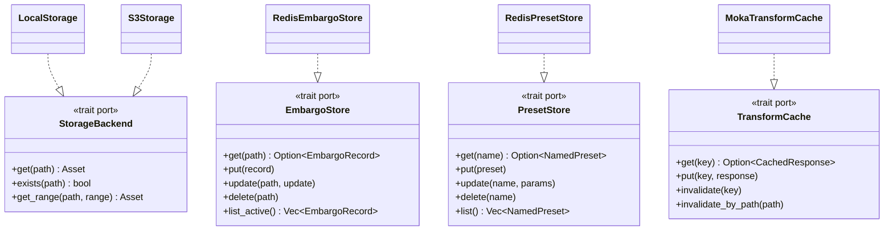

# Application Design — Consolidated

This document consolidates the four application design artifacts into a single
reference. See the individual files for full detail.

---

## Architectural Decisions Resolved

| ADR | Decision |
|---|---|
| ADR-0010 | Embargo store: **Redis (ElastiCache)** |
| ADR-0013 | Admin API: **separate `TcpListener` on `127.0.0.1:3001`** |
| ADR-0014 | Config parsing: **`envy` crate** |
| ADR-0015 | Per-IP rate limiting: **`tower-governor`** |
| ADR-0016 | OIDC validation: **`jsonwebtoken` + manual JWKS cache** |
| ADR-0017 | Metrics: **`prometheus` crate** |
| ADR-0018 | HTTP 206 video: **custom `Range` header parsing** |

---

## Component Summary

| ID | Module | Responsibility |
|---|---|---|
| C-01 | `src/config.rs` | Load and validate all `RENDITION_*` env vars into `AppConfig` |
| C-02 | `src/storage/` | `StorageBackend` trait + `LocalStorage` + `S3Storage` with circuit breaker |
| C-03 | `src/transform/` | libvips pipeline, format negotiation, `spawn_blocking` wrapper |
| C-04 | `src/cache.rs` | In-process LRU transform cache (`moka`), SHA-256 cache key |
| C-05 | `src/embargo/` | Embargo data model, `EmbargoStore` trait, `RedisEmbargoStore`, `EmbargoEnforcer` |
| C-06 | `src/preset/` | Named preset store, `PresetStore` trait, `RedisPresetStore`, param merge |
| C-07 | `src/api/` | CDN request handler, `AppState`, full per-request pipeline |
| C-08 | `src/admin/` | Admin router, `AuthLayer` (OIDC + API key), embargo/preset/purge handlers |
| C-09 | `src/middleware/` | Tower layers: RequestId, Trace, RateLimit, SecurityHeaders, Compression |
| C-10 | `src/observability/` | Prometheus metrics, OTEL exporter, `/health/live`, `/health/ready`, `/metrics` |

---

## Module File Tree

```text
src/
├── main.rs                   — startup: load config, init OTEL, bind listeners
├── lib.rs                    — build_app(): wire components, stack middleware
├── config.rs                 — C-01: AppConfig, envy loading, validation
├── storage/
│   ├── mod.rs                — C-02: StorageBackend trait, Asset, content_type helper
│   ├── local.rs              — LocalStorage impl
│   └── s3.rs                 — S3Storage impl + CircuitBreaker
├── transform/
│   ├── mod.rs                — C-03: TransformParams, apply(), negotiate_format()
│   └── pipeline.rs           — apply_blocking(), per-step functions
├── cache.rs                  — C-04: TransformCache trait, MokaTransformCache, compute_cache_key()
├── embargo/
│   ├── mod.rs                — C-05: EmbargoRecord, EmbargoStore trait, EmbargoEnforcer
│   └── redis_store.rs        — RedisEmbargoStore impl
├── preset/
│   ├── mod.rs                — C-06: NamedPreset, PresetStore trait, resolve_params()
│   └── redis_store.rs        — RedisPresetStore impl (shares Redis pool with embargo)
├── api/
│   └── mod.rs                — C-07: AppState, cdn_router(), serve_asset()
├── admin/
│   ├── mod.rs                — C-08: admin_router(), AdminState
│   ├── auth.rs               — AuthLayer, JwksCache, AdminIdentity
│   ├── embargo_handlers.rs   — CRUD handlers for /admin/embargoes
│   ├── preset_handlers.rs    — CRUD handlers for /admin/presets
│   └── purge_handlers.rs     — POST /admin/purge handler
├── middleware/
│   └── mod.rs                — C-09: cdn_middleware_stack(), security_headers_layer()
└── observability/
    ├── mod.rs                — C-10: Metrics, init_otel(), OtelGuard
    └── health.rs             — liveness_handler(), readiness_handler()
```

---

## Service Summary

| ID | Service | Orchestrator | Key flow |
|---|---|---|---|
| SVC-01 | Asset Delivery | `serve_asset` | preset → embargo → cache → storage → transform → headers → respond |
| SVC-02 | Embargo Management | `embargo_handlers` | auth → validate → store → invalidate local cache → audit |
| SVC-03 | Preset Management | `preset_handlers` | auth → validate → store → resolve on CDN path |
| SVC-04 | Admin Authentication | `AuthLayer` | JWT validate (JWKS) or API key hash compare → inject identity |
| SVC-05 | Application Bootstrap | `main` / `lib` | config → OTEL → metrics → storage → Redis → cache → routers → listeners |
| SVC-06 | Cache Purge | `purge_handlers` | auth → invalidate in-process cache → return surrogate key for CDN |

---

## Key Trait Boundaries (Ports)



---

## Critical Design Constraints

1. **AWS SDK confined to `src/storage/s3.rs`** — zero leakage into API or
   transform layers (ADR-0004 / NFR-06).
2. **libvips confined to `src/transform/`** — callers see only `Vec<u8>`.
3. **Redis client confined to `src/embargo/redis_store.rs` and
   `src/preset/redis_store.rs`** — callers see only traits.
4. **`prometheus` imports confined to `src/observability/`** — all other
   components use `Metrics::record_*()` methods.
5. **Embargoed assets must never enter the transform cache** (FR-14 /
   ADR-0008) — enforced in `serve_asset` by returning 451 before `cache.put`.
6. **Admin components must not be imported by CDN-path components** — the two
   routers share state via `Arc<dyn Trait>` boundaries only.
7. **`AppConfig` is immutable after bootstrap** — `Arc<AppConfig>` only.

---

## Open Decisions Carried Forward

| Topic | Status | Resolves In |
|---|---|---|
| Redis crate selection (`fred` vs `redis`) | Unresolved | Functional Design — Unit 5 |
| Redis connection pool size | Unresolved | NFR Design — Unit 5 |
| `RENDITION_RATE_LIMIT_KEY` default (`peer_ip` vs `x_forwarded_for`) | Unresolved | NFR Design — Unit 6 |
| Audit trail storage (structured log vs separate store) | FR-14 says audit log — structured log is sufficient for v1 | Code Generation — Unit 5 |
| Background embargo cleanup job | FR-14 SHOULD — deferred to v2 if Redis TTL handles it natively | Code Generation — Unit 5 |
