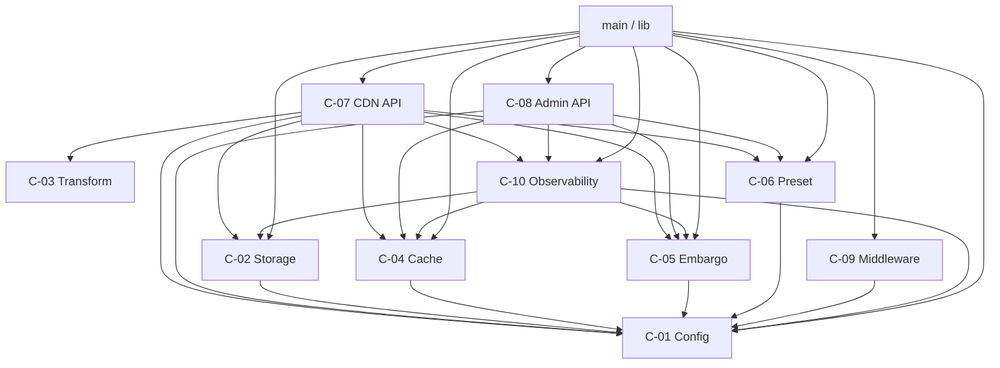
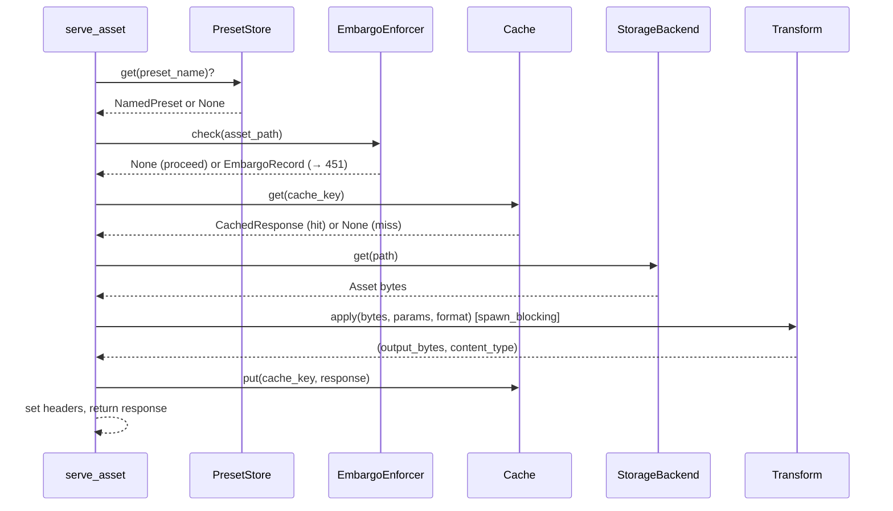

# Component Dependencies

## Dependency Matrix

`→` means "depends on (calls / imports)"

| Component | C-01 Config | C-02 Storage | C-03 Transform | C-04 Cache | C-05 Embargo | C-06 Preset | C-07 CDN API | C-08 Admin API | C-09 Middleware | C-10 Observability |
|---|---|---|---|---|---|---|---|---|---|---|
| **C-01 Config** | — | | | | | | | | | |
| **C-02 Storage** | → | — | | | | | | | | |
| **C-03 Transform** | | | — | | | | | | | |
| **C-04 Cache** | → | | → (key only) | — | | | | | | |
| **C-05 Embargo** | → | | | | — | | | | | |
| **C-06 Preset** | → | | → (types) | | | — | | | | |
| **C-07 CDN API** | → | → | → | → | → | → | — | | → | → |
| **C-08 Admin API** | → | | | → | → | → | | — | → | → |
| **C-09 Middleware** | → | | | | | | | | — | |
| **C-10 Observability** | → | → (health) | | → (health) | → (health) | | | | | — |
| **main.rs / lib.rs** | → | → | | → | → | → | → | → | → | → |

---

## Dependency Diagram

---

## Communication Patterns

### In-Process Synchronous (function call / trait method)

All component interactions within a single request are in-process function calls.
There are no message queues, channels, or RPCs between components at runtime.

| Caller | Callee | Pattern |
|---|---|---|
| `serve_asset` | `EmbargoEnforcer` | `async fn check()` — awaited |
| `serve_asset` | `TransformCache` | sync `get()` / `put()` — moka is thread-safe |
| `serve_asset` | `StorageBackend` | `async fn get()` — awaited |
| `serve_asset` | `transform::apply()` | `tokio::spawn_blocking` — offloads to thread pool |
| `serve_asset` | `PresetStore` | `async fn get()` — awaited only if `?preset=` present |
| Admin handlers | `EmbargoStore` | `async fn put/delete/list` — awaited |
| Admin handlers | `EmbargoEnforcer` | sync `invalidate()` — in-process HashMap |

### External I/O

| Component | External System | Protocol | Sync model |
|---|---|---|---|
| `S3Storage` | Amazon S3 | HTTPS / AWS SDK | async |
| `RedisEmbargoStore` | Redis / ElastiCache | TCP / RESP | async (`fred`) |
| `RedisPresetStore` | Redis / ElastiCache | TCP / RESP | async (`fred`) |
| `JwksCache` | OIDC Provider (JWKS URL) | HTTPS / `reqwest` | async (cached) |
| `OtelExporter` | OTEL Collector | gRPC / OTLP | async (background) |
| Prometheus scraper | `GET /metrics` | HTTP | sync (text render) |

---

## Data Flow — CDN Request

---

## Coupling Constraints

These rules are enforced by module visibility (`pub(crate)`, `pub(super)`) and
the hexagonal architecture principle (ADR-0004):

1. **No AWS SDK types outside `src/storage/s3.rs`** — `Asset` is the only type
   that crosses the storage boundary.
2. **No libvips types outside `src/transform/`** — callers see only `Vec<u8>`
   and `&'static str`.
3. **No Redis types outside `src/embargo/redis_store.rs` and
   `src/preset/redis_store.rs`** — callers interact via `EmbargoStore` and
   `PresetStore` traits.
4. **No `prometheus` imports outside `src/observability/`** — other components
   call `Metrics::record_*()` methods.
5. **`AppConfig` is read-only after startup** — wrapped in `Arc<AppConfig>`,
   never mutated.
6. **Admin components must not be imported by CDN-path components** — admin
   code lives only in `src/admin/`; CDN code must not depend on it.
