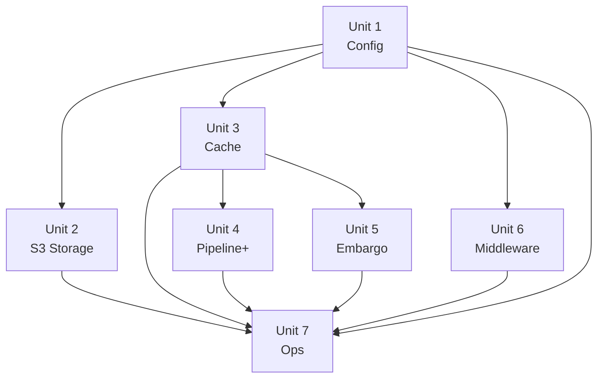

# Unit of Work Dependencies

## Dependency Matrix

`→` means "depends on (must be complete before starting)"

| Unit | 1 Config | 2 S3 Storage | 3 Cache | 4 Pipeline+ | 5 Embargo | 6 Middleware | 7 Ops |
|---|---|---|---|---|---|---|---|
| **1 Config** | — | | | | | | |
| **2 S3 Storage** | → | — | | | | | |
| **3 Cache** | → | | — | | | | |
| **4 Pipeline+** | → | | → | — | | | |
| **5 Embargo** | → | | → | | — | | |
| **6 Middleware** | → | | | | | — | |
| **7 Ops** | → | → | → | → | → | → | — |

## Dependency Graph



## Development Sequence

```text
Sprint 1:  Unit 1 — Config
Sprint 2:  Unit 2 — S3 Storage Backend    (no dependency on Unit 3)
Sprint 3:  Unit 3 — Transform Cache       (no dependency on Unit 2)
Sprint 4:  Unit 4 — Pipeline Enhancements (depends on 1, 3)
Sprint 5:  Unit 5 — Embargo + Admin API   (depends on 1, 3)
Sprint 6:  Unit 6 — Middleware            (depends on 1 only)
Sprint 7:  Unit 7 — Observability & Ops   (depends on all)
```

Units 2 and 3 are sequenced rather than parallelised (single contributor).
Units 4 and 5 are sequenced for the same reason. If contributors join, Units
2/3 and Units 4/5 can be developed on parallel branches simultaneously.

## Inter-Unit Interfaces

These are the shared boundaries across unit lines. Changes to these interfaces
require updating all dependent units.

| Interface | Defined in | Consumed by |
|---|---|---|
| `AppConfig` struct | Unit 1 | All |
| `StorageBackend` trait | Unit 2 (no change) | Unit 4, Unit 5, Unit 7 |
| `StorageBackend::get_range` | Unit 4 | Unit 7 (health check) |
| `TransformCache` trait | Unit 3 | Unit 4, Unit 5, Unit 6 |
| `compute_cache_key` | Unit 3 | Unit 4, Unit 5 |
| `CachedResponse` type | Unit 3 | Unit 4, Unit 5 |
| `AppState<S>` struct | Unit 3 (extended) | Unit 4, Unit 5, Unit 6, Unit 7 |
| `EmbargoEnforcer` | Unit 5 | Unit 4 (serve_asset), Unit 7 (health) |
| `EmbargoStore` trait | Unit 5 | Unit 7 (health check) |
| `PresetStore` trait | Unit 5 | Unit 4 (preset resolution) |
| `Metrics` struct | Unit 7 | Units 2–6 (record_* calls) |

## Shared State Additions per Unit

`AppState<S>` grows as units complete:

| After Unit | AppState fields present |
|---|---|
| 1 | `config: Arc<AppConfig>` |
| 2 | + `storage: Arc<S>` |
| 3 | + `cache: Arc<dyn TransformCache>` |
| 4 | + `presets: Arc<dyn PresetStore>` (Unit 5 provides impl) |
| 5 | + `embargo: Arc<EmbargoEnforcer>` |
| 6 | No AppState changes — middleware applied at router level |
| 7 | + `metrics: Arc<Metrics>` |

## Risk: Unit 4 / Unit 5 Partial Dependency

Unit 4 uses `PresetStore` for `?preset=` resolution. `RedisPresetStore` is
delivered in Unit 5. Resolution:

- Unit 4 codes against the `PresetStore` trait (already defined in Application
  Design)
- A `NoopPresetStore` stub returns `None` for all `get()` calls during Unit 4
  development
- Unit 5 replaces the stub with `RedisPresetStore` when wiring `AppState`

This keeps Unit 4 testable without Redis and avoids a hard dependency on Unit 5
completing first.
