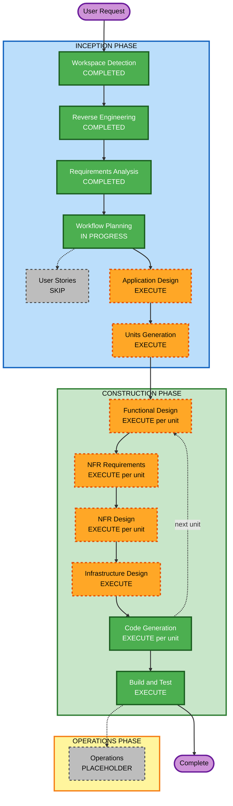

# Execution Plan

## Detailed Analysis Summary

### Transformation Scope

- **Transformation Type**: Architectural — system-wide expansion of a single-crate Rust
  service into a production-grade enterprise CDN with new modules, middleware layers,
  admin API surface, and observability infrastructure.
- **Primary Changes**:
  - New `src/config.rs` — typed env-var driven configuration (foundation for all units)
  - New `src/storage/s3.rs` — S3 adapter behind existing `StorageBackend` trait
  - New `src/cache.rs` — LRU transform cache
  - New `src/embargo/` — embargo data model, storage trait, management API, enforcement
  - New `src/middleware/` — rate limiting, security headers, request ID, error hardening
  - New `src/observability/` — Prometheus metrics, OpenTelemetry traces, health probes
  - New `src/admin/` — admin router with authentication middleware
  - New `k8s/` and `Dockerfile` — Kubernetes manifests and container image
- **Existing Files Modified**: `src/lib.rs`, `src/api/mod.rs`, `src/main.rs`,
  `Cargo.toml`

### Change Impact Assessment

- **User-facing changes**: Yes — new `HTTP 451` responses for embargoed assets;
  new `/metrics`, `/health/live`, `/health/ready` endpoints; rate-limit `429` responses.
- **Structural changes**: Yes — introduces admin API surface (first authenticated
  endpoints), embargo persistent store (first external state dependency), middleware
  pipeline, observability layer.
- **Data model changes**: Yes — `EmbargoRecord` with path, datetime, audit fields;
  `Config` typed struct; cache key type.
- **API changes**: Yes — new admin routes; CDN route gains embargo enforcement;
  health endpoint split into `/live` and `/ready`.
- **NFR impact**: Yes — all quality attributes (QA-01 through QA-09) require structural
  changes or new infrastructure.

### Component Relationships

- **Primary Component**: `rendition` crate (single Cargo package)
- **Foundation Layer**: `src/config.rs` — all other units depend on it
- **Storage Layer**: `src/storage/s3.rs` → `StorageBackend` trait (no change to trait)
- **Caching Layer**: `src/cache.rs` → consumed by `src/api/mod.rs`
- **Embargo Layer**: `src/embargo/` → consumed by `src/api/mod.rs` (enforcement) and
  new `src/admin/` (management API)
- **Middleware Layer**: `src/middleware/` → applied at `src/lib.rs` router level
- **Observability Layer**: `src/observability/` → consumed by `src/lib.rs` and
  `src/main.rs`
- **Supporting**: `Dockerfile`, `k8s/`, `load-tests/`

### Risk Assessment

- **Risk Level**: High
- **Rollback Complexity**: Moderate — units are independent; each can be feature-flagged
  or reverted individually since they extend rather than replace existing modules
- **Testing Complexity**: Complex — circuit breaker, rate limiter, embargo enforcement,
  and graceful shutdown all require time-sensitive or stateful tests

## Workflow Visualization



### Text Alternative

```text
INCEPTION PHASE
  [x] Workspace Detection       — COMPLETED
  [x] Reverse Engineering       — COMPLETED
  [x] Requirements Analysis     — COMPLETED
  [ ] User Stories              — SKIP (backend-only, no personas, requirements fully cover scope)
  [x] Workflow Planning         — IN PROGRESS
  [ ] Application Design        — EXECUTE
  [ ] Units Generation          — EXECUTE

CONSTRUCTION PHASE (per unit)
  [ ] Functional Design         — EXECUTE
  [ ] NFR Requirements          — EXECUTE
  [ ] NFR Design                — EXECUTE
  [ ] Infrastructure Design     — EXECUTE
  [ ] Code Generation           — EXECUTE (always)
  [ ] Build and Test            — EXECUTE (always)

OPERATIONS PHASE
  [ ] Operations                — PLACEHOLDER
```

## Phases to Execute

### INCEPTION PHASE

- [x] Workspace Detection — COMPLETED
- [x] Reverse Engineering — COMPLETED
- [x] Requirements Analysis — COMPLETED
- [ ] User Stories — **SKIP**
  - **Rationale**: All work is backend infrastructure and API development with no
    user-facing UX flows. Requirements fully define the acceptance criteria. No multiple
    personas. Stories would not add architectural value here.
- [x] Workflow Planning — IN PROGRESS
- [ ] Application Design — **EXECUTE**
  - **Rationale**: Six new modules, a new admin API surface, first authenticated
    endpoints, first persistent state dependency (embargo store), and the open
    architectural decision on embargo storage backend all require explicit component
    design before code generation.
- [ ] Units Generation — **EXECUTE**
  - **Rationale**: Work spans 6 distinct units (see below) with sequential dependency
    constraints. Decomposition prevents context overload and enables incremental testing.

### CONSTRUCTION PHASE

- [ ] Functional Design — **EXECUTE** (for Units 3, 4, 5 — complex business logic)
  - **Rationale**: Cache eviction semantics, embargo enforcement state machine, and
    PBT-01 property identification all require explicit functional design.
- [ ] NFR Requirements — **EXECUTE** (for all units)
  - **Rationale**: `proptest` framework selection (PBT-09) and per-unit performance
    budgets need to be formally recorded.
- [ ] NFR Design — **EXECUTE** (for Units 2, 4, 6)
  - **Rationale**: Circuit breaker pattern (Unit 2), embargo fail-closed design (Unit 4),
    and OTEL/Prometheus wiring (Unit 6) require explicit NFR design before code.
- [ ] Infrastructure Design — **EXECUTE** (for Unit 6)
  - **Rationale**: Dockerfile, Kubernetes manifests, CI pipeline, and `cargo-audit`
    integration need infrastructure design.
- [ ] Code Generation — **EXECUTE** (always, per unit)
- [ ] Build and Test — **EXECUTE** (always)

### OPERATIONS PHASE

- [ ] Operations — PLACEHOLDER

## Proposed Units of Work

The work decomposes into 6 sequential units with a dependency-first ordering:

| # | Unit | Key Deliverables | Depends On |
|---|------|-----------------|------------|
| 1 | **Config** | `src/config.rs`, env-var parsing, fail-fast validation, tests | — |
| 2 | **S3 Storage Backend** | `src/storage/s3.rs`, circuit breaker, retry, `S3StorageBackend` | Unit 1 |
| 3 | **Transform Cache** | `src/cache.rs`, LRU + TTL, cache key, metrics counters | Unit 1 |
| 4 | **Transform Pipeline Enhancements** | `fmt=auto` (FR-15), sharpening (FR-16), smart crop (FR-19), watermark (FR-17), video passthrough + HTTP 206 (FR-22) | Units 1, 3 |
| 5 | **Embargoed Assets + Presets** | `src/embargo/`, `src/preset/`, admin API, CDN enforcement, embargo store trait (FR-11–14, FR-18) | Units 1, 3 |
| 6 | **Middleware** | Rate limiting, security headers, request ID, error hardening, input validation, `Vary`, Surrogate-Key headers (FR-04–09, FR-21) | Unit 1 |
| 7 | **Observability & Ops** | Prometheus `/metrics`, OTEL traces, health probes, graceful shutdown, Dockerfile, K8s, custom domain config (FR-20, QA-02–06) | All |

**Critical path**: Unit 1 → Units 2/3 (parallel) → Units 4/5 (parallel) → Unit 6 → Unit 7

## Module Update Sequence

```text
Unit 1: Config
  ├── Unit 2: S3 Storage Backend (parallel with Unit 3)
  └── Unit 3: Transform Cache (parallel with Unit 2)
        ├── Unit 4: Transform Pipeline Enhancements (parallel with Unit 5)
        └── Unit 5: Embargoed Assets + Presets (parallel with Unit 4)
              └── Unit 6: Middleware
                    └── Unit 7: Observability & Ops
```

Units 2/3 have no inter-dependency; Units 4/5 both depend on Units 1 and 3 but not
each other. AI-DLC will execute all units sequentially for focus and testability.

## Success Criteria

- **Primary Goal**: Production-grade enterprise CDN ready for lululemon-scale traffic
- **Key Deliverables**:
  - Fully functional S3 backend with circuit breaker and retry
  - Embargo feature with admin API and CDN enforcement
  - All middleware (rate limiting, security headers, validation, request ID)
  - Prometheus metrics + OpenTelemetry traces
  - Kubernetes-ready deployment (Dockerfile + manifests)
  - `cargo-audit` in CI, `cargo-llvm-cov` coverage gate ≥ 80%
  - `proptest` PBT suite for transform invariants, config parsing, cache keys
- **Quality Gates**:
  - All 15 Security Baseline rules: compliant
  - All 10 PBT rules: compliant
  - 80% line/branch coverage measured by `cargo-llvm-cov`
  - P99 latency ≤ 10 ms (cache hit), ≤ 500 ms (full transform) — validated by load test
  - `cargo-audit`: zero high/critical CVEs
