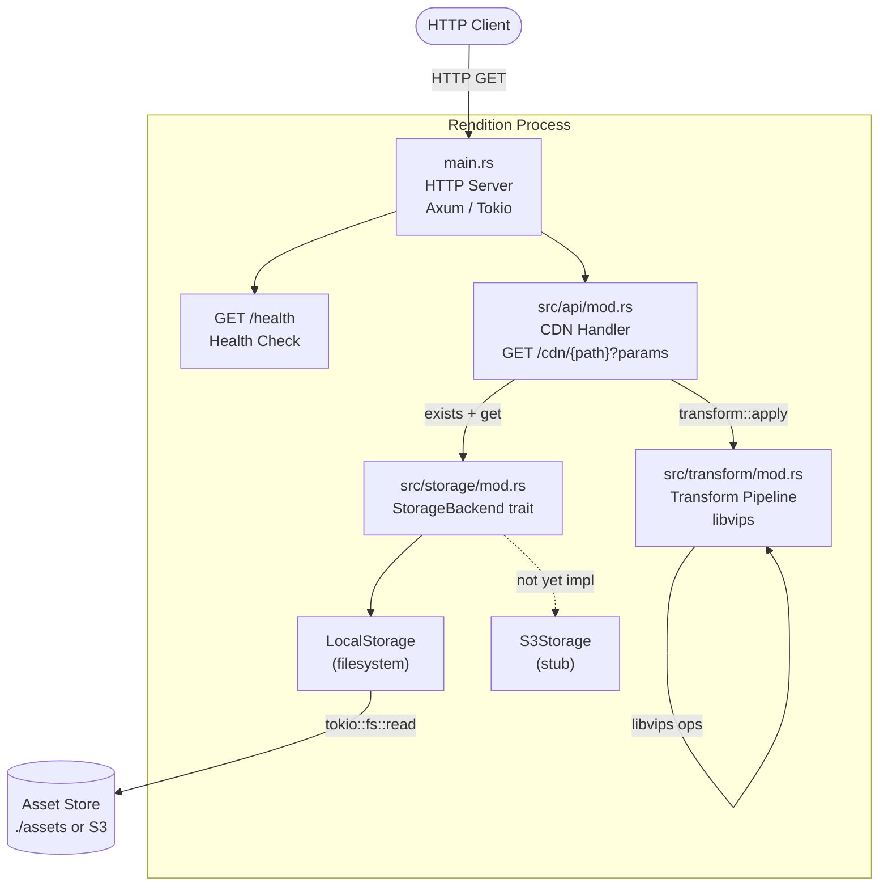
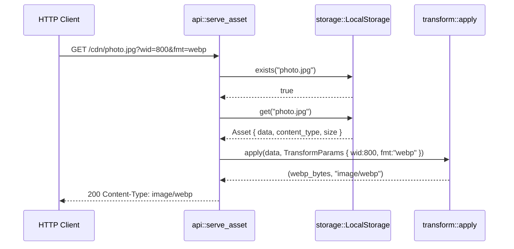

# System Architecture

## System Overview

Rendition is a single-process Rust HTTP service built on Axum and Tokio. It exposes a
Scene7-compatible CDN endpoint that fetches media assets from a pluggable storage backend
and applies on-the-fly image transformations powered by libvips before streaming the
result to the caller.

## Architecture Diagram

## Component Descriptions

### `main.rs` — Entry Point

- **Purpose**: Bootstrap; initialises logging, reads `RENDITION_ASSETS_PATH`, and starts
  the Axum HTTP server on `0.0.0.0:3000`.
- **Responsibilities**: Tracing setup, env-var resolution, `build_app` invocation, server
  lifecycle.
- **Dependencies**: `rendition` lib crate, `tracing-subscriber`, `tokio`.
- **Type**: Application binary.

### `src/lib.rs` — Library Root

- **Purpose**: Shared router construction logic used by both the binary and integration
  tests.
- **Responsibilities**: Assembles the Axum `Router`, wires `LocalStorage` into
  `AppState`, registers routes, applies `TraceLayer`.
- **Dependencies**: `api`, `storage` modules; `axum`, `tower-http`.
- **Type**: Library crate root.

### `src/api/mod.rs` — HTTP API Layer

- **Purpose**: URL-to-transform CDN API following Scene7 URL conventions.
- **Responsibilities**: Query-string parsing (`TransformParams`), storage existence check,
  storage retrieval, transform dispatch, HTTP response assembly, unit tests.
- **Dependencies**: `storage::StorageBackend`, `transform::apply`.
- **Type**: Application module.

### `src/storage/mod.rs` — Storage Abstraction

- **Purpose**: Storage-agnostic interface for fetching media assets.
- **Responsibilities**: `StorageBackend` trait definition, `LocalStorage` implementation
  (filesystem), `S3Storage` stub, MIME-type-from-extension detection.
- **Dependencies**: `tokio::fs`, `anyhow`.
- **Type**: Application module.

### `src/transform/mod.rs` — Transform Pipeline

- **Purpose**: All image processing logic.
- **Responsibilities**: libvips initialisation (once per process), parameter struct
  (`TransformParams`), pipeline execution (crop → resize → rotate → flip → encode),
  format encoding (JPEG, WebP, AVIF, PNG).
- **Dependencies**: `libvips` crate.
- **Type**: Application module.

### `tests/e2e.rs` — End-to-End Test Suite

- **Purpose**: Full-stack integration tests against real `LocalStorage` + libvips.
- **Type**: Integration test crate.

## Data Flow

## Integration Points

- **External APIs**: None (self-contained HTTP service).
- **Databases**: None (stateless; assets live in the storage backend).
- **Third-party Services**: libvips (native C library linked at compile time).

## Infrastructure Components

- **CDK Stacks**: None.
- **Deployment Model**: Single binary, runs as a long-lived process; assets served from
  a local directory or (planned) S3 bucket.
- **Networking**: Listens on `0.0.0.0:3000`; port/host not yet configurable via env var.
