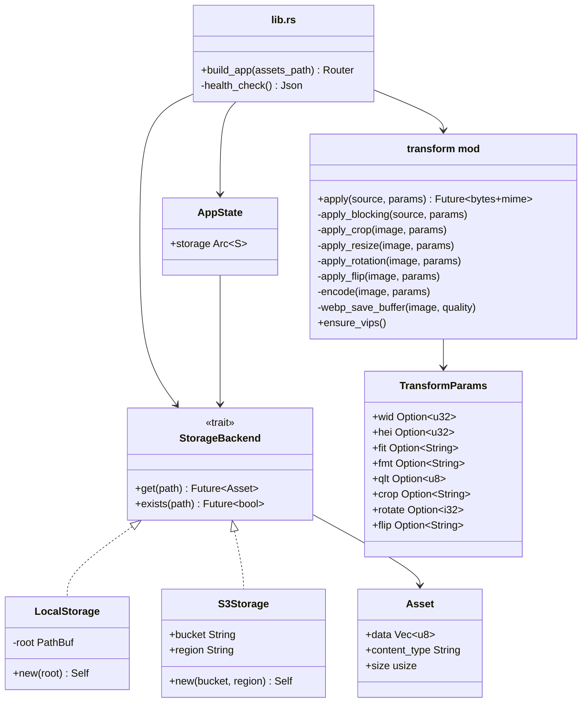

# Code Structure

## Build System

- **Type**: Cargo (Rust)
- **Configuration**: `Cargo.toml` at workspace root; custom linker logic in `build.rs`
- **Edition**: Rust 2021
- **Key build files**: `Cargo.toml`, `build.rs`, `.cargo/config.toml`

## Key Modules

## Existing Files Inventory

- `src/main.rs` — Binary entry point; logging init, env-var resolution, server startup
- `src/lib.rs` — Library root; `build_app` factory function, health-check handler
- `src/api/mod.rs` — CDN HTTP handler, `AppState<S>`, `router<S>()`, `serve_asset<S>`
- `src/storage/mod.rs` — `StorageBackend` trait, `Asset` struct, `LocalStorage`,
  `S3Storage` stub, `content_type_from_ext` helper
- `src/transform/mod.rs` — `TransformParams`, `apply()`, full image pipeline,
  libvips init guard
- `build.rs` — Linker search-path injection for libvips (macOS aarch64 + `VIPS_LIB_DIR`)
- `.cargo/config.toml` — `rustflags` for aarch64-apple-darwin libvips path
- `tests/e2e.rs` — End-to-end integration tests (health, CDN, format, resize, error)
- `Cargo.toml` — Package manifest and dependency declarations

## Design Patterns

### Trait-Based Abstraction (Strategy)

- **Location**: `src/storage/mod.rs` — `StorageBackend` trait
- **Purpose**: Allows swapping storage backends (local, S3, etc.) without changing the
  API or transform layers.
- **Implementation**: `StorageBackend` uses return-position `impl Future` for async
  methods; `AppState<S>` is generic over `S: StorageBackend`.

### Generic State Injection

- **Location**: `src/api/mod.rs` — `AppState<S>`, `router<S>()`, `serve_asset<S>`
- **Purpose**: Enables testability — unit tests inject a `MockStorage` instead of
  `LocalStorage`.
- **Implementation**: Axum `State` extractor carries `AppState<S>` through the handler.

### One-Time Initialization (Singleton)

- **Location**: `src/transform/mod.rs` — `VIPS_APP: OnceLock<VipsApp>`
- **Purpose**: libvips must be initialised exactly once per process; panics on double
  init.
- **Implementation**: `std::sync::OnceLock` guarantees single initialisation in a
  thread-safe manner.

### Pipeline / Chain of Responsibility

- **Location**: `src/transform/mod.rs` — `apply_blocking`
- **Purpose**: Each transform step (crop → resize → rotate → flip → encode) consumes
  the previous `VipsImage` and produces a new one, keeping stages independent.
- **Implementation**: Sequential function calls chained with the `?` operator.

## Critical Dependencies

### axum 0.7

- **Usage**: HTTP router, extractors (`Path`, `Query`, `State`), response types.
- **Purpose**: Async HTTP framework for the CDN API.

### tokio 1 (full)

- **Usage**: Async runtime, `tokio::fs` for file I/O, `spawn_blocking` for libvips.
- **Purpose**: Async I/O and CPU-bound task offloading.

### libvips 1.7.3

- **Usage**: `VipsApp`, `VipsImage`, `ops::resize*`, `ops::extract_area`, `ops::rot`,
  `ops::flip`, `ops::jpegsave_buffer*`, `ops::pngsave_buffer`,
  `ops::heifsave_buffer_with_opts`.
- **Purpose**: High-performance image decoding, transformation, and encoding.

### tower-http 0.5 (trace, cors, fs)

- **Usage**: `TraceLayer` applied to the root router.
- **Purpose**: Structured HTTP request/response tracing.

### serde / serde_json 1

- **Usage**: `#[derive(Deserialize)]` on `TransformParams`; health-check JSON body.
- **Purpose**: Query-string deserialisation and JSON response serialisation.

### anyhow 1

- **Usage**: All fallible internal functions return `anyhow::Result`.
- **Purpose**: Ergonomic error propagation with context.

### axum-test 14 (dev)

- **Usage**: `TestServer` in unit and integration tests.
- **Purpose**: In-process HTTP test client without binding a real socket.

### tempfile 3 (dev)

- **Usage**: `TempDir` in storage unit tests and e2e tests.
- **Purpose**: Temporary filesystem directories for test fixtures.
