# Rendition — Architecture

Rendition is an open-source, enterprise-ready media CDN written in Rust.
It delivers on-demand image transformations via URL parameters, serving as a
modern alternative to Adobe Scene7 / Dynamic Media.

---

## Level 1 — System Context

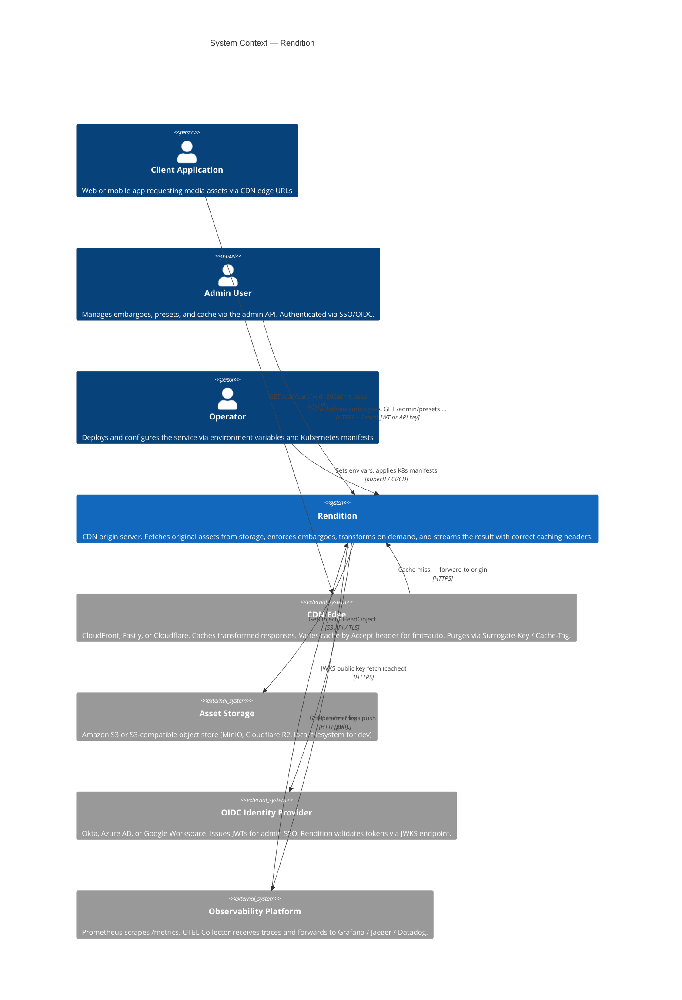

**Primary responsibilities:**

- Accept HTTP requests with URL-encoded transform parameters (Scene7-compatible)
- Enforce asset embargoes before any storage I/O; return `HTTP 451` for blocked assets
- Check the in-process LRU transform cache before invoking libvips
- Retrieve original assets from a pluggable storage backend (S3 or local)
- Apply a sequential image transform pipeline (crop → resize → sharpen → watermark → rotate → flip → encode)
- Serve the best format the client supports when `fmt=auto` is requested (`Vary: Accept`)
- Set `Surrogate-Key` and `Cache-Control` headers so the CDN edge can cache and purge efficiently
- Expose an authenticated admin API for embargo and preset management
- Emit Prometheus metrics and OpenTelemetry traces for full observability

---

## Level 2 — Container View

```mermaid
C4Container
    title Container View — Rendition Service

    Person(client, "Client")
    Person(admin, "Admin User")

    Container_Boundary(svc, "Rendition Process") {
        Container(mw, "CDN Middleware Stack", "Rust · Tower layers", "RequestId, TraceLayer, per-IP GCRA rate limit (tower-governor, ADR-0015), security headers, compression. Applied to :3000 only.")
        Container(http, "CDN Request Handler", "Rust · Axum 0.7 · :3000", "Routes /cdn/* requests. Runs embargo check, cache lookup, storage fetch, transform, and header emission.")
        Container(admin_api, "Admin API Handler", "Rust · Axum 0.7 · 127.0.0.1:3001", "Separate internal listener (ADR-0013). Routes /admin/* behind AuthLayer. Validates OIDC JWT (jsonwebtoken, ADR-0016) or API key hash. Manages embargoes, presets, cache purge.")
        Container(health, "Health Endpoints", "Rust · async fn", "GET /health/live — always 200. GET /health/ready — checks storage + embargo store + circuit breaker state.")
        Container(metrics, "Metrics Endpoint", "Rust · prometheus crate", "GET /metrics — Prometheus text format. Cache hits/misses, request latency histograms, storage errors, embargo rejections.")
        Container(embargo, "Embargo Enforcer", "Rust · src/embargo/", "Checks active embargo records for the requested asset path. In-process HashMap cache (10 s TTL) in front of the embargo store.")
        Container(cache, "Transform Cache", "Rust · moka · src/cache.rs", "Thread-safe LRU cache keyed on SHA-256(path + params). Bounded by RENDITION_CACHE_MAX_ENTRIES (default 1 000). TTL per entry.")
        Container(pipeline, "Transform Pipeline", "Rust · libvips 8.x · src/transform/", "Decodes source bytes. Applies crop, resize, sharpen, watermark, rotate, flip in sequence. Encodes to target format. fmt=auto resolves via Accept header.")
        Container(storage_adapters, "Storage Adapters", "Rust · trait StorageBackend · src/storage/", "LocalStorage and S3Storage. S3Storage includes a circuit breaker (configurable threshold/cooldown). Chosen at startup via config.")
        Container(preset, "Preset Store", "Rust · src/preset/ · Redis", "Named transform presets. RedisPresetStore shares the ElastiCache connection pool with EmbargoStore.")
        Container(config, "Config Module", "Rust · src/config.rs · envy", "Reads all RENDITION_* env vars at startup via envy (ADR-0014). Validates required fields. Typed AppConfig injected into AppState.")
        Container(otel, "OTEL Exporter", "Rust · opentelemetry-otlp", "Exports traces and structured log events to the configured OTLP endpoint (RENDITION_OTEL_ENDPOINT).")
    }

    System_Ext(storage_ext, "Asset Storage", "S3 / MinIO / Local filesystem")
    System_Ext(embargo_store, "Embargo + Preset Store", "Redis (ElastiCache) — ADR-0010. Namespaced keys: embargo:{path}, preset:{name}. Native TTL via EXPIREAT.")
    System_Ext(idp_ext, "OIDC Provider", "Okta / Azure AD / Google Workspace")
    System_Ext(prom, "Prometheus", "Scrapes /metrics every 15 s")
    System_Ext(otel_collector, "OTEL Collector", "Receives OTLP push")

    Rel(client, mw, "GET /cdn/shoe.jpg?wid=800&fmt=auto", "HTTP :3000")
    Rel(admin, admin_api, "POST /admin/embargoes/{path}", "HTTP 127.0.0.1:3001 + Bearer")
    Rel(mw, http, "CDN requests", "in-process Tower")
    Rel(mw, health, "/health/* requests", "in-process")
    Rel(mw, metrics, "/metrics requests", "in-process")
    Rel(http, embargo, "check_embargo(path)", "in-process")
    Rel(http, preset, "get(preset_name)?", "in-process async")
    Rel(embargo, embargo_store, "get_embargo(path) on cache miss", "Redis async")
    Rel(http, cache, "get(key) / put(key, bytes)", "in-process")
    Rel(http, storage_adapters, "get(path) / get_range(path, range)", "async")
    Rel(http, pipeline, "apply(bytes, params, accept)", "tokio::spawn_blocking")
    Rel(admin_api, idp_ext, "JWKS fetch (1 h cache)", "HTTPS")
    Rel(admin_api, embargo_store, "put/update/delete embargo", "Redis async")
    Rel(admin_api, preset, "put/delete preset", "Redis async")
    Rel(storage_adapters, storage_ext, "GetObject / HeadObject / GetObject+Range", "S3 API / TLS")
    Rel(prom, metrics, "GET /metrics", "HTTP pull")
    Rel(otel, otel_collector, "OTLP gRPC push", "gRPC / TLS")
```

**Key runtime characteristics:**

| Concern | Approach |
|---|---|
| Concurrency | Tokio multi-threaded async executor |
| CPU-bound work | `tokio::task::spawn_blocking` for libvips calls |
| Shared state | `Arc<AppState<S>>` injected via Axum `State` extractor |
| In-process cache | `moka::future::Cache` — async, thread-safe, bounded LRU with TTL (ADR-0009) |
| Storage fault isolation | Circuit breaker on `S3Storage`; `LocalStorage` used in dev/test |
| Rate limiting | Per-IP GCRA via `tower-governor` on CDN listener (ADR-0015) |
| Admin isolation | Admin router on `127.0.0.1:3001` — separate `TcpListener` (ADR-0013) |
| Admin authentication | OIDC JWT via `jsonwebtoken` + JWKS cache, or SHA-256 API key (ADR-0016) |
| Embargo store | Redis (ElastiCache) behind `EmbargoStore` trait; in-process read-through cache (ADR-0010) |
| Configuration | `envy::prefixed("RENDITION_")` deserialises env vars into typed `AppConfig` (ADR-0014) |
| Observability | `TraceLayer` + `tracing` + `prometheus` crate `/metrics` + OTLP traces (ADR-0017) |
| Format negotiation | `fmt=auto` resolves `Accept` header to concrete format before cache key computed (ADR-0011) |
| CDN cache control | `Surrogate-Key: asset:<path>` + `Cache-Control` + `Vary: Accept` on CDN responses (ADR-0012) |
| Video delivery | Custom `Range` header parsing; `S3Storage::get_range` passes range to `GetObject` (ADR-0018) |

---

## Level 3 — Component View

```mermaid
C4Component
    title Component View — Rendition

    Container_Boundary(lib, "rendition (lib)") {
        Component(build_app, "build_app()", "pub fn → Router", "Reads AppConfig. Wires storage backend, embargo enforcer, transform cache, and admin auth into AppState. Stacks Tower middleware layers. Merges all routers.")
        Component(app_state, "AppState<S>", "pub struct", "Holds Arc<S: StorageBackend>, Arc<TransformCache>, Arc<EmbargoEnforcer>, Arc<dyn PresetStore>, Arc<Metrics>, Arc<AppConfig>. Cloned into each handler by Axum.")
        Component(config_mod, "config::AppConfig", "pub struct · envy (ADR-0014)", "envy::prefixed(RENDITION_) deserialises all env vars. Fields: bind_addr, admin_bind_addr, storage_backend, s3 config, oidc config, cache settings, rate limit settings, otel endpoint.")

        Component(cdn_router, "api::router()", "pub fn → Router", "Registers GET /cdn/*asset_path. Wires AppState<S>.")
        Component(serve_asset, "serve_asset<S>()", "async fn", "1. embargo check → 451. 2. cache lookup → hit returns bytes. 3. storage.get() → bytes. 4. apply() pipeline. 5. cache.put(). 6. set Surrogate-Key + Cache-Control headers. 7. return bytes + Content-Type.")
        Component(fmt_negotiator, "negotiate_format()", "fn", "Parses Accept header q-values. Returns best format Rendition can produce. Order: AVIF > WebP > PNG (alpha) > JPEG.")

        Component(admin_router, "admin::router()", "pub fn → Router (ADR-0013)", "Bound to 127.0.0.1:3001. Registers CRUD /admin/embargoes/*, /admin/presets/*, POST /admin/purge. All routes behind AuthLayer.")
        Component(auth_layer, "admin::AuthLayer", "Tower middleware (ADR-0016)", "Extracts Bearer token. Mode A: validates JWT via JwksCache (jsonwebtoken + reqwest, 1 h JWKS TTL, force-refresh on key rotation). Mode B: SHA-256 compare against RENDITION_ADMIN_API_KEYS. Injects AdminIdentity on success; 401/403 on failure.")
        Component(jwks_cache, "admin::JwksCache", "pub struct", "Fetches and caches JWKS keys from OIDC provider. RwLock<(keys, expiry)>. Force-refreshes once on InvalidSignature before returning 401.")
        Component(embargo_handlers, "admin::embargo_handlers", "async fn", "CRUD for /admin/embargoes. Calls EmbargoStore + EmbargoEnforcer.invalidate() on delete/update. Returns Surrogate-Key in response body for operator CDN purge.")
        Component(preset_handlers, "admin::preset_handlers", "async fn", "CRUD for /admin/presets. Calls PresetStore.")
        Component(preset_store_trait, "preset::PresetStore", "pub trait", "get/put/update/delete/list. Implemented by RedisPresetStore.")
        Component(redis_preset, "preset::RedisPresetStore", "PresetStore impl", "fred crate. key namespace preset:{name}. Shares Redis connection pool with RedisEmbargoStore.")

        Component(embargo_enforcer, "embargo::EmbargoEnforcer", "pub struct", "In-process HashMap<path, EmbargoRecord> with 10 s TTL. On miss, reads from EmbargoStore trait. Returns Some(EmbargoRecord) if asset is currently embargoed.")
        Component(embargo_store_trait, "embargo::EmbargoStore", "pub trait", "get/put/update/delete/list_active. Single implementation: RedisEmbargoStore (fred crate, ADR-0010). Key namespace embargo:{path}. Native TTL via EXPIREAT.")

        Component(cache_trait, "cache::TransformCache", "pub trait", "get(key) → Option<CachedResponse>. put(key, response). Implemented by MokaTransformCache. Embargoed assets must not be stored.")
        Component(moka_cache, "cache::MokaTransformCache", "TransformCache impl", "moka::future::Cache<[u8;32], CachedResponse>. Bounded by max_capacity. Per-entry TTL. Thread-safe async API.")
        Component(cache_key, "cache::compute_key()", "fn → [u8; 32]", "SHA-256(asset_path bytes || canonical JSON of TransformParams). Canonical serialisation ensures parameter order does not affect cache hits.")

        Component(storage_trait, "storage::StorageBackend", "pub trait", "get(path) → Result<Asset>. exists(path) → bool. get_range(path, range) → Result<Asset> — S3Storage overrides to pass Range to GetObject (ADR-0018). Send + Sync + 'static.")
        Component(local_storage, "storage::LocalStorage", "StorageBackend impl", "Resolves paths relative to root PathBuf. tokio::fs::read. MIME from extension.")
        Component(s3_storage, "storage::S3Storage", "StorageBackend impl", "aws-sdk-s3 GetObject / HeadObject. Circuit breaker (configurable threshold / cooldown). Credential chain: instance profile → env vars → shared config.")
        Component(circuit_breaker, "storage::CircuitBreaker", "pub struct", "Tracks consecutive S3 errors. Opens after threshold; auto-closes after cooldown. /health/ready reflects open state.")

        Component(transform_params, "transform::TransformParams", "pub struct · Deserialize", "wid, hei, fit, fmt (including Auto variant), qlt, crop, rotate, flip, sharpening sigma, watermark path + opacity. All Option<T>.")
        Component(apply_fn, "transform::apply()", "pub async fn", "Resolves fmt=auto to concrete format via negotiate_format(). Wraps apply_blocking in spawn_blocking.")
        Component(apply_blocking, "transform::apply_blocking()", "fn", "Pipeline: decode → crop → resize → sharpen → watermark → rotate → flip → encode. Returns (Vec<u8>, &'static str content_type).")

        Component(health_handlers, "health_check / readiness_check", "async fn", "GET /health/live → 200 always. GET /health/ready → checks storage reachability and circuit breaker state.")
        Component(metrics_handler, "metrics::handler", "async fn", "Renders Prometheus text from global registry. rendition_cache_hits_total, rendition_cache_misses_total, rendition_transform_duration_seconds, rendition_embargo_rejections_total, rendition_storage_errors_total.")
    }

    Container_Boundary(bin, "rendition (bin)") {
        Component(main_fn, "main()", "async fn", "Loads AppConfig (envy). Initialises OTEL. Builds AppState. Binds two TcpListeners: RENDITION_BIND_ADDR (:3000) for CDN, RENDITION_ADMIN_BIND_ADDR (127.0.0.1:3001) for admin (ADR-0013). Runs both via tokio::spawn. Handles SIGTERM graceful shutdown.")
    }

    Rel(main_fn, build_app, "calls with AppConfig", "")
    Rel(build_app, config_mod, "reads via envy", "")
    Rel(build_app, cdn_router, "binds :3000", "")
    Rel(build_app, admin_router, "binds 127.0.0.1:3001", "")
    Rel(serve_asset, embargo_enforcer, "check_embargo(path)", "")
    Rel(serve_asset, preset_store_trait, "get(preset_name)?", "")
    Rel(serve_asset, cache_trait, "get(key) / put(key, …)", "")
    Rel(serve_asset, storage_trait, "get(path) / get_range(path, range)", "")
    Rel(serve_asset, apply_fn, "apply(bytes, params, accept)", "")
    Rel(serve_asset, fmt_negotiator, "negotiates format for fmt=auto", "")
    Rel(cache_trait, cache_key, "uses", "")
    Rel(moka_cache, cache_trait, "implements", "")
    Rel(embargo_enforcer, embargo_store_trait, "delegates to on miss", "")
    Rel(admin_router, auth_layer, "wrapped by", "")
    Rel(auth_layer, jwks_cache, "validates JWT via", "")
    Rel(admin_router, embargo_handlers, "routes to", "")
    Rel(admin_router, preset_handlers, "routes to", "")
    Rel(preset_handlers, preset_store_trait, "calls", "")
    Rel(redis_preset, preset_store_trait, "implements", "")
    Rel(local_storage, storage_trait, "implements", "")
    Rel(s3_storage, storage_trait, "implements", "")
    Rel(s3_storage, circuit_breaker, "uses", "")
    Rel(apply_fn, apply_blocking, "spawn_blocking", "")
```

---

## Request Lifecycle — CDN Cache Hit

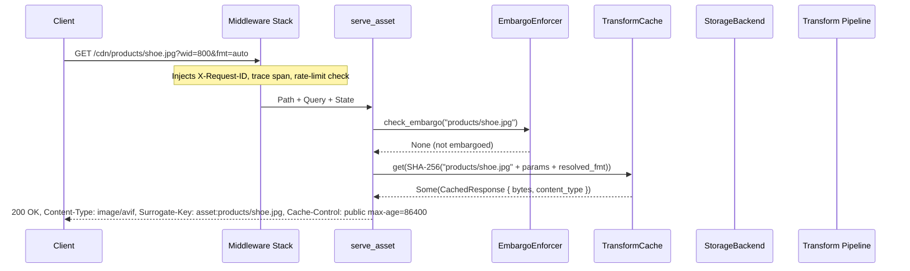

---

## Request Lifecycle — Cache Miss with fmt=auto

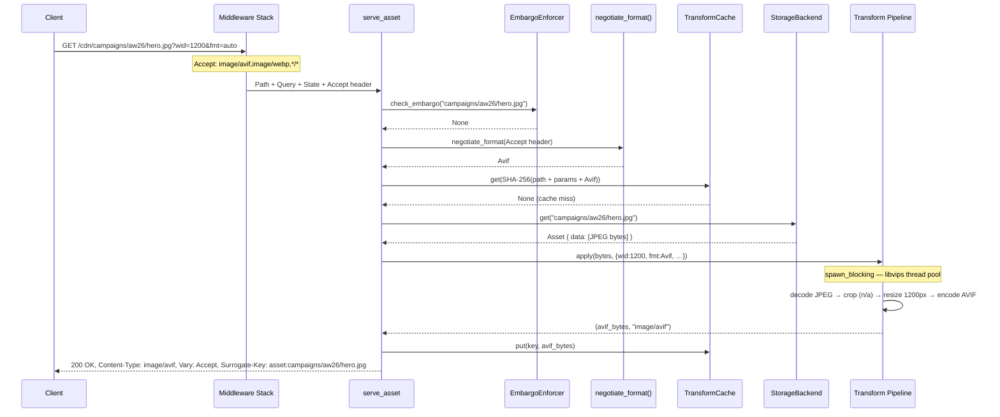

---

## Request Lifecycle — Embargoed Asset

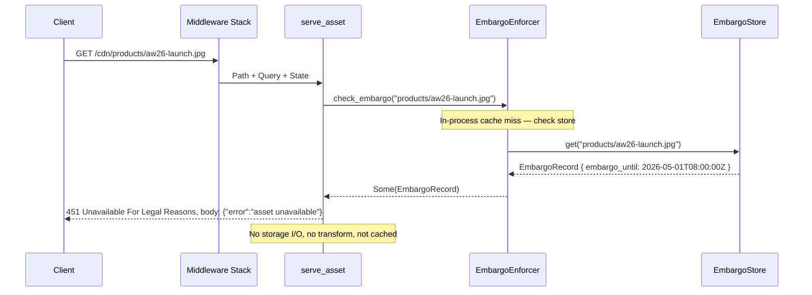

---

## Admin API — Create Embargo (OIDC Auth)

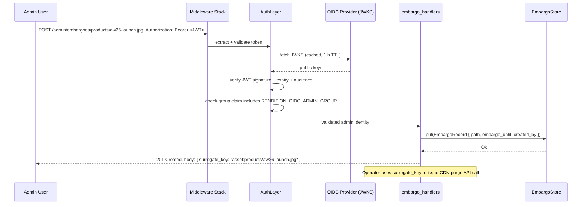

---

## Transform Pipeline — Operation Order

```mermaid
flowchart LR
    A[Raw bytes\nfrom storage] --> B[Decode\nnew_from_buffer]
    B --> FMT{fmt=auto?}
    FMT -- yes --> NEG[negotiate_format\nAccept header → AVIF/WebP/PNG/JPEG]
    FMT -- no --> CROP
    NEG --> CROP
    CROP{crop\nparam set?}
    CROP -- yes --> D[extract_area\nx,y,w,h]
    CROP -- no --> E{wid or hei\nset?}
    D --> E
    E -- yes --> F{fit mode}
    E -- no --> SHARP
    F -- constrain\ndefault --> F1[ops::resize\nscale = min ratio]
    F -- crop --> F2[ops::resize max ratio\n+ extract_area center]
    F -- stretch\nfill --> F3[ops::resize\nindependent hscale/vscale]
    F1 --> SHARP
    F2 --> SHARP
    F3 --> SHARP
    SHARP{sharpening\nparam set?}
    SHARP -- yes --> SH[ops::sharpen\nsigma]
    SHARP -- no --> WM
    SH --> WM
    WM{watermark\nparam set?}
    WM -- yes --> WMO[composite overlay\nwatermark + opacity]
    WM -- no --> G
    WMO --> G
    G{rotate\nparam set?}
    G -- 90/180/270 --> H[ops::rot]
    G -- none --> I{flip\nparam set?}
    H --> I
    I -- h/v/hv --> J[ops::flip]
    I -- none --> K{resolved\nformat}
    J --> K
    K -- AVIF --> M[heifsave_buffer\nAV1 + quality]
    K -- WebP --> L[webpsave_buffer\nwith quality]
    K -- PNG --> N[pngsave_buffer\nlossless]
    K -- JPEG\ndefault --> O[jpegsave_buffer\nwith quality]
    L --> P[Return bytes\n+ MIME type]
    M --> P
    N --> P
    O --> P
```

---

## Middleware Stack — Tower Layer Order

Layers are applied outermost-first (each wraps all inner layers):

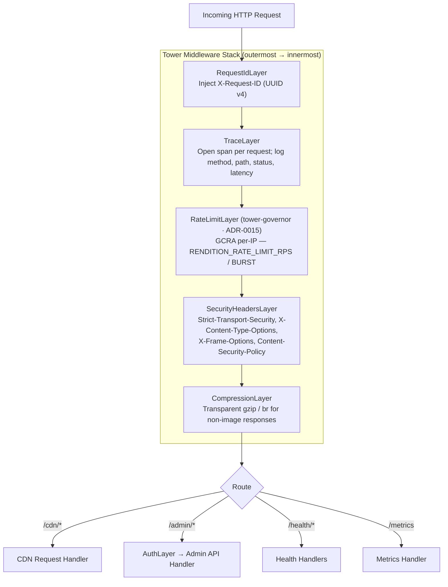

---

## Storage Backend — Class Diagram

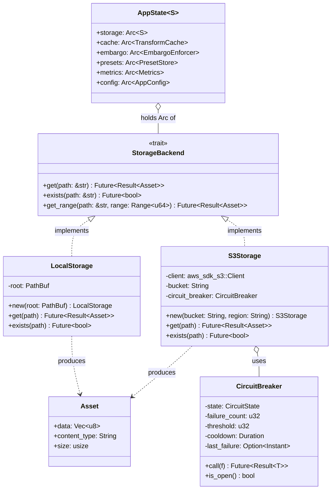

---

## Deployment Topology — Kubernetes

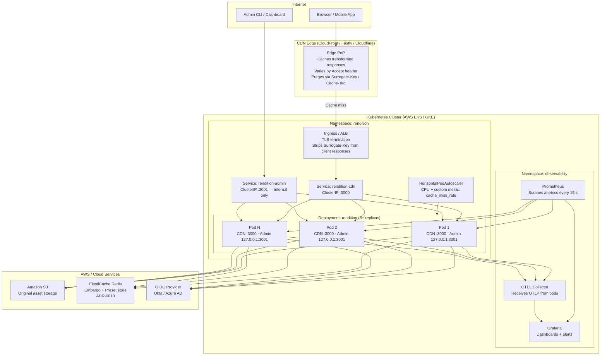

**Scaling notes:**

| Concern | Approach |
|---|---|
| Horizontal scale | Each pod has its own LRU cache; CDN edge acts as the shared caching layer |
| CPU spikes | `spawn_blocking` isolates libvips from the async executor; HPA scales on CPU |
| S3 fault isolation | Circuit breaker opens on consecutive errors; `/health/ready` reports state; K8s stops routing to unready pods |
| Embargo consistency | Redis (ElastiCache) is the authoritative store; in-process read-through cache TTL is 30 s (configurable) |
| Admin isolation | `rendition-admin` ClusterIP service on port 3001 — never exposed via Ingress or CDN |
| Zero-downtime deploy | Rolling update strategy; readiness probe on `/health/ready`; liveness probe on `/health/live` |

---

## Module File Tree

```text
src/
├── main.rs                      — startup: load AppConfig (envy), init OTEL, bind two listeners
├── lib.rs                       — build_app(): wire all components, stack middleware
├── config.rs                    — AppConfig, S3Config, OidcConfig; envy + validate()
├── storage/
│   ├── mod.rs                   — StorageBackend trait, Asset, content_type_from_ext()
│   ├── local.rs                 — LocalStorage
│   └── s3.rs                    — S3Storage + CircuitBreaker (aws-sdk-s3)
├── transform/
│   ├── mod.rs                   — TransformParams, ImageFormat, apply(), negotiate_format()
│   └── pipeline.rs              — apply_blocking(), per-step pure functions
├── cache.rs                     — TransformCache trait, MokaTransformCache, compute_cache_key()
├── embargo/
│   ├── mod.rs                   — EmbargoRecord, EmbargoStore trait, EmbargoEnforcer
│   └── redis_store.rs           — RedisEmbargoStore (fred crate)
├── preset/
│   ├── mod.rs                   — NamedPreset, PresetStore trait, resolve_params()
│   └── redis_store.rs           — RedisPresetStore (shares Redis pool with embargo)
├── api/
│   └── mod.rs                   — AppState, cdn_router(), serve_asset()
├── admin/
│   ├── mod.rs                   — admin_router(), AdminState
│   ├── auth.rs                  — AuthLayer, JwksCache, AdminIdentity
│   ├── embargo_handlers.rs      — CRUD /admin/embargoes
│   ├── preset_handlers.rs       — CRUD /admin/presets
│   └── purge_handlers.rs        — POST /admin/purge
├── middleware/
│   └── mod.rs                   — cdn_middleware_stack(), security_headers_layer()
└── observability/
    ├── mod.rs                   — Metrics (prometheus), init_otel(), OtelGuard
    └── health.rs                — liveness_handler(), readiness_handler()
```

---

## ADR Quick Reference

| ADR | Decision | Status |
|---|---|---|
| [0001](adr/0001-rust-as-runtime.md) | Rust as the primary runtime | Accepted |
| [0002](adr/0002-axum-http-framework.md) | Axum as the HTTP framework | Accepted |
| [0003](adr/0003-libvips-image-processing.md) | libvips for image processing | Accepted |
| [0004](adr/0004-pluggable-storage-backends.md) | Pluggable storage via trait abstraction | Accepted |
| [0005](adr/0005-scene7-url-compatibility.md) | Scene7-compatible URL parameter naming | Accepted |
| [0006](adr/0006-library-binary-crate-split.md) | Split into library + binary crates | Accepted |
| [0007](adr/0007-oidc-sso-admin-authentication.md) | OIDC / SSO for admin authentication | Accepted |
| [0008](adr/0008-http-451-for-embargoed-assets.md) | HTTP 451 for embargoed assets | Accepted |
| [0009](adr/0009-lru-transform-cache.md) | In-process LRU transform cache (`moka`) | Accepted |
| [0010](adr/0010-embargo-store-backend.md) | Embargo store — Redis (ElastiCache) | Accepted |
| [0011](adr/0011-automatic-format-negotiation.md) | `fmt=auto` via Accept header | Accepted |
| [0012](adr/0012-surrogate-key-cdn-cache-invalidation.md) | Surrogate-Key CDN cache invalidation | Accepted |
| [0013](adr/0013-admin-api-dual-port-listener.md) | Admin API on separate port `127.0.0.1:3001` | Accepted |
| [0014](adr/0014-envy-configuration-parsing.md) | `envy` for environment variable config | Accepted |
| [0015](adr/0015-tower-governor-rate-limiting.md) | `tower-governor` GCRA per-IP rate limiting | Accepted |
| [0016](adr/0016-jsonwebtoken-oidc-validation.md) | `jsonwebtoken` + JWKS cache for OIDC | Accepted |
| [0017](adr/0017-prometheus-metrics-crate.md) | `prometheus` crate for metrics | Accepted |
| [0018](adr/0018-http-206-custom-range-parsing.md) | Custom `Range` parsing for HTTP 206 video | Accepted |
