# Rendition — Architecture

Rendition is an open-source, enterprise-ready media CDN written in Rust.
It delivers on-demand image transformations via URL parameters, serving as a
modern alternative to Adobe Scene7 / Dynamic Media.

---

## Level 1 — System Context

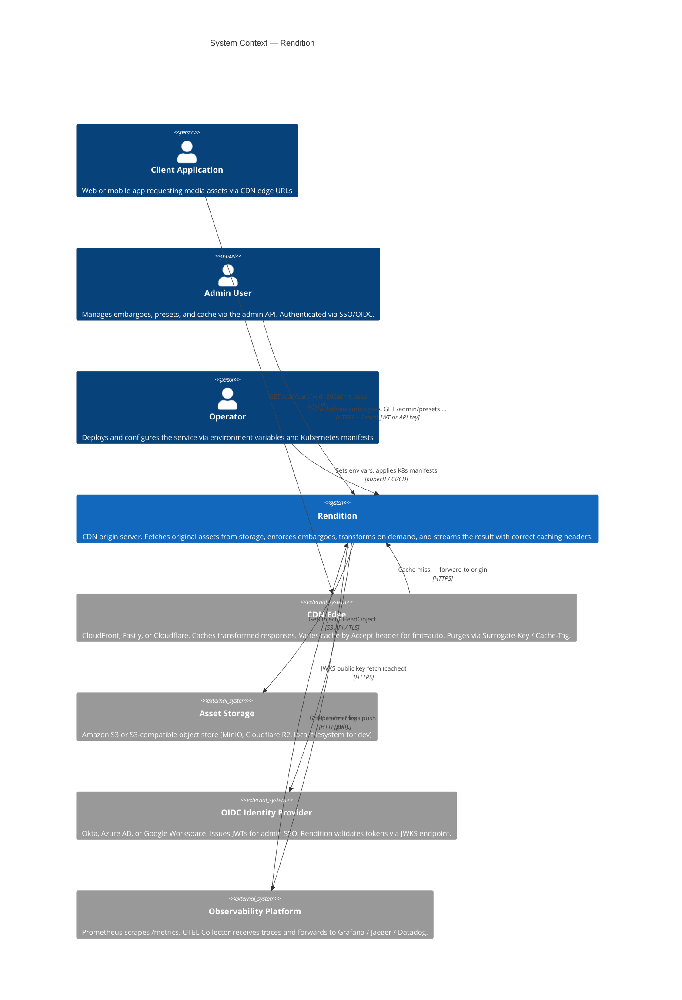

**Primary responsibilities:**

- Accept HTTP requests with URL-encoded transform parameters (Scene7-compatible)
- Enforce asset embargoes before any storage I/O; return `HTTP 451` for blocked assets
- Check the in-process LRU transform cache before invoking libvips
- Retrieve original assets from a pluggable storage backend (S3 or local)
- Apply a sequential image transform pipeline (crop → resize → sharpen → watermark → rotate → flip → encode)
- Serve the best format the client supports when `fmt=auto` is requested (`Vary: Accept`)
- Set `Surrogate-Key` and `Cache-Control` headers so the CDN edge can cache and purge efficiently
- Expose an authenticated admin API for embargo and preset management
- Emit Prometheus metrics and OpenTelemetry traces for full observability

---

## Level 2 — Container View

```mermaid
C4Container
    title Container View — Rendition Service

    Person(client, "Client")
    Person(admin, "Admin User")

    Container_Boundary(svc, "Rendition Process") {
        Container(mw, "Middleware Stack", "Rust · Tower layers", "Request ID injection, structured trace logging, rate limiting (token bucket), security headers (HSTS, CSP, X-Content-Type-Options), response compression.")
        Container(http, "CDN Request Handler", "Rust · Axum 0.7", "Routes /cdn/* requests. Runs embargo check, cache lookup, storage fetch, transform, and header emission.")
        Container(admin_api, "Admin API Handler", "Rust · Axum 0.7", "Routes /admin/* requests. Validates OIDC JWT or API key. Manages embargoes, presets, cache invalidation.")
        Container(health, "Health Endpoints", "Rust · async fn", "GET /health/live — always 200. GET /health/ready — checks storage + embargo store + circuit breaker state.")
        Container(metrics, "Metrics Endpoint", "Rust · prometheus crate", "GET /metrics — Prometheus text format. Cache hits/misses, request latency histograms, storage errors, embargo rejections.")
        Container(embargo, "Embargo Enforcer", "Rust · src/embargo/", "Checks active embargo records for the requested asset path. In-process HashMap cache (10 s TTL) in front of the embargo store.")
        Container(cache, "Transform Cache", "Rust · moka · src/cache.rs", "Thread-safe LRU cache keyed on SHA-256(path + params). Bounded by RENDITION_CACHE_MAX_ENTRIES (default 1 000). TTL per entry.")
        Container(pipeline, "Transform Pipeline", "Rust · libvips 8.x · src/transform/", "Decodes source bytes. Applies crop, resize, sharpen, watermark, rotate, flip in sequence. Encodes to target format. fmt=auto resolves via Accept header.")
        Container(storage_adapters, "Storage Adapters", "Rust · trait StorageBackend · src/storage/", "LocalStorage and S3Storage. S3Storage includes a circuit breaker (configurable threshold/cooldown). Chosen at startup via config.")
        Container(config, "Config Module", "Rust · src/config.rs", "Reads all RENDITION_* env vars at startup. Validates required fields. Exposes typed AppConfig struct injected into AppState.")
        Container(otel, "OTEL Exporter", "Rust · opentelemetry-otlp", "Exports traces and structured log events to the configured OTLP endpoint (RENDITION_OTEL_ENDPOINT).")
    }

    System_Ext(storage_ext, "Asset Storage", "S3 / MinIO / Local filesystem")
    System_Ext(embargo_store, "Embargo Store", "Redis, DynamoDB, or PostgreSQL (ADR-0010 — TBD)")
    System_Ext(idp_ext, "OIDC Provider", "Okta / Azure AD / Google Workspace")
    System_Ext(prom, "Prometheus", "Scrapes /metrics every 15 s")
    System_Ext(otel_collector, "OTEL Collector", "Receives OTLP push")

    Rel(client, mw, "GET /cdn/shoe.jpg?wid=800&fmt=auto", "HTTP")
    Rel(admin, mw, "POST /admin/embargoes/{path}", "HTTP + Bearer")
    Rel(mw, http, "CDN requests", "in-process Tower")
    Rel(mw, admin_api, "Admin requests", "in-process Tower")
    Rel(mw, health, "/health/* requests", "in-process Tower")
    Rel(mw, metrics, "/metrics requests", "in-process Tower")
    Rel(http, embargo, "check_embargo(path)", "in-process")
    Rel(embargo, embargo_store, "get_embargo(path)", "async")
    Rel(http, cache, "get(key)", "in-process")
    Rel(http, storage_adapters, "get(path)", "async")
    Rel(http, pipeline, "apply(bytes, params, accept)", "tokio::spawn_blocking")
    Rel(http, cache, "put(key, bytes)", "in-process")
    Rel(admin_api, idp_ext, "JWKS public key fetch", "HTTPS (cached)")
    Rel(admin_api, embargo_store, "put/delete embargo record", "async")
    Rel(storage_adapters, storage_ext, "GetObject / HeadObject", "S3 API / TLS")
    Rel(prom, metrics, "GET /metrics", "HTTP pull")
    Rel(otel, otel_collector, "OTLP gRPC push", "gRPC / TLS")
```

**Key runtime characteristics:**

| Concern | Approach |
|---|---|
| Concurrency | Tokio multi-threaded async executor |
| CPU-bound work | `tokio::task::spawn_blocking` for libvips calls |
| Shared state | `Arc<AppState<S>>` injected via Axum `State` extractor |
| In-process cache | `moka::future::Cache` — async, thread-safe, bounded LRU with TTL |
| Storage fault isolation | Circuit breaker on S3Storage; `LocalStorage` used in dev/test |
| Observability | `TraceLayer` + `tracing` structured logs + Prometheus counters/histograms + OTLP traces |
| Configuration | All `RENDITION_*` env vars read once at startup into typed `AppConfig` |
| Format negotiation | `fmt=auto` resolves `Accept` header to concrete format before cache key is computed |
| CDN cache control | `Surrogate-Key: asset:<path>` + `Cache-Control: public, max-age=<ttl>` on every CDN response |

---

## Level 3 — Component View

```mermaid
C4Component
    title Component View — Rendition

    Container_Boundary(lib, "rendition (lib)") {
        Component(build_app, "build_app()", "pub fn → Router", "Reads AppConfig. Wires storage backend, embargo enforcer, transform cache, and admin auth into AppState. Stacks Tower middleware layers. Merges all routers.")
        Component(app_state, "AppState<S>", "pub struct", "Holds Arc<S: StorageBackend>, Arc<TransformCache>, Arc<EmbargoEnforcer>, Arc<AppConfig>. Cloned into each handler by Axum.")
        Component(config_mod, "config::AppConfig", "pub struct", "Reads RENDITION_ASSETS_PATH, RENDITION_S3_BUCKET, RENDITION_OIDC_ISSUER, RENDITION_OIDC_AUDIENCE, RENDITION_OIDC_ADMIN_GROUP, RENDITION_CACHE_MAX_ENTRIES, RENDITION_CACHE_TTL_SECONDS, RENDITION_RATE_LIMIT_RPS, RENDITION_OTEL_ENDPOINT, and others.")

        Component(cdn_router, "api::router()", "pub fn → Router", "Registers GET /cdn/*asset_path. Wires AppState<S>.")
        Component(serve_asset, "serve_asset<S>()", "async fn", "1. embargo check → 451. 2. cache lookup → hit returns bytes. 3. storage.get() → bytes. 4. apply() pipeline. 5. cache.put(). 6. set Surrogate-Key + Cache-Control headers. 7. return bytes + Content-Type.")
        Component(fmt_negotiator, "negotiate_format()", "fn", "Parses Accept header q-values. Returns best format Rendition can produce. Order: AVIF > WebP > PNG (alpha) > JPEG.")

        Component(admin_router, "admin::router()", "pub fn → Router", "Registers POST/GET/DELETE /admin/embargoes/*, GET/POST /admin/presets/*, POST /admin/purge. All routes behind auth middleware.")
        Component(auth_layer, "admin::AuthLayer", "Tower middleware", "Extracts Bearer token or X-Api-Key header. Validates JWT via JWKS (cached). Checks group membership (RENDITION_OIDC_ADMIN_GROUP). Rejects with 401/403.")
        Component(embargo_handlers, "admin::embargo_handlers", "async fn set, list, delete", "CRUD for embargo records. Writes to EmbargoStore. Returns webhook payload including Surrogate-Key value for CDN purge integration.")

        Component(embargo_enforcer, "embargo::EmbargoEnforcer", "pub struct", "In-process HashMap<path, EmbargoRecord> with 10 s TTL. On miss, reads from EmbargoStore trait. Returns Some(EmbargoRecord) if asset is currently embargoed.")
        Component(embargo_store_trait, "embargo::EmbargoStore", "pub trait", "get(path) → Option<EmbargoRecord>. put(record). delete(path). Implemented by RedisEmbargoStore, DynamoDbEmbargoStore, PostgresEmbargoStore.")

        Component(cache_trait, "cache::TransformCache", "pub trait", "get(key) → Option<CachedResponse>. put(key, response). Implemented by MokaTransformCache. Embargoed assets must not be stored.")
        Component(moka_cache, "cache::MokaTransformCache", "TransformCache impl", "moka::future::Cache<[u8;32], CachedResponse>. Bounded by max_capacity. Per-entry TTL. Thread-safe async API.")
        Component(cache_key, "cache::compute_key()", "fn → [u8; 32]", "SHA-256(asset_path bytes || canonical JSON of TransformParams). Canonical serialisation ensures parameter order does not affect cache hits.")

        Component(storage_trait, "storage::StorageBackend", "pub trait", "get(path) → Result<Asset>. exists(path) → bool. Send + Sync + 'static.")
        Component(local_storage, "storage::LocalStorage", "StorageBackend impl", "Resolves paths relative to root PathBuf. tokio::fs::read. MIME from extension.")
        Component(s3_storage, "storage::S3Storage", "StorageBackend impl", "aws-sdk-s3 GetObject / HeadObject. Circuit breaker (configurable threshold / cooldown). Credential chain: instance profile → env vars → shared config.")
        Component(circuit_breaker, "storage::CircuitBreaker", "pub struct", "Tracks consecutive S3 errors. Opens after threshold; auto-closes after cooldown. /health/ready reflects open state.")

        Component(transform_params, "transform::TransformParams", "pub struct · Deserialize", "wid, hei, fit, fmt (including Auto variant), qlt, crop, rotate, flip, sharpening sigma, watermark path + opacity. All Option<T>.")
        Component(apply_fn, "transform::apply()", "pub async fn", "Resolves fmt=auto to concrete format via negotiate_format(). Wraps apply_blocking in spawn_blocking.")
        Component(apply_blocking, "transform::apply_blocking()", "fn", "Pipeline: decode → crop → resize → sharpen → watermark → rotate → flip → encode. Returns (Vec<u8>, &'static str content_type).")

        Component(health_handlers, "health_check / readiness_check", "async fn", "GET /health/live → 200 always. GET /health/ready → checks storage reachability and circuit breaker state.")
        Component(metrics_handler, "metrics::handler", "async fn", "Renders Prometheus text from global registry. rendition_cache_hits_total, rendition_cache_misses_total, rendition_transform_duration_seconds, rendition_embargo_rejections_total, rendition_storage_errors_total.")
    }

    Container_Boundary(bin, "rendition (bin)") {
        Component(main_fn, "main()", "async fn", "Loads AppConfig. Initialises OTEL exporter. Calls build_app(). Binds TCP on :3000 (or RENDITION_PORT).")
    }

    Rel(main_fn, build_app, "calls with AppConfig", "")
    Rel(build_app, config_mod, "reads", "")
    Rel(build_app, cdn_router, "merges", "")
    Rel(build_app, admin_router, "merges", "")
    Rel(serve_asset, embargo_enforcer, "check_embargo(path)", "")
    Rel(serve_asset, cache_trait, "get(key) / put(key, …)", "")
    Rel(serve_asset, storage_trait, "get(path)", "")
    Rel(serve_asset, apply_fn, "apply(bytes, params, accept)", "")
    Rel(serve_asset, fmt_negotiator, "negotiates format for fmt=auto", "")
    Rel(cache_trait, cache_key, "uses", "")
    Rel(moka_cache, cache_trait, "implements", "")
    Rel(embargo_enforcer, embargo_store_trait, "delegates to on miss", "")
    Rel(admin_router, auth_layer, "wrapped by", "")
    Rel(admin_router, embargo_handlers, "routes to", "")
    Rel(local_storage, storage_trait, "implements", "")
    Rel(s3_storage, storage_trait, "implements", "")
    Rel(s3_storage, circuit_breaker, "uses", "")
    Rel(apply_fn, apply_blocking, "spawn_blocking", "")
```

---

## Request Lifecycle — CDN Cache Hit

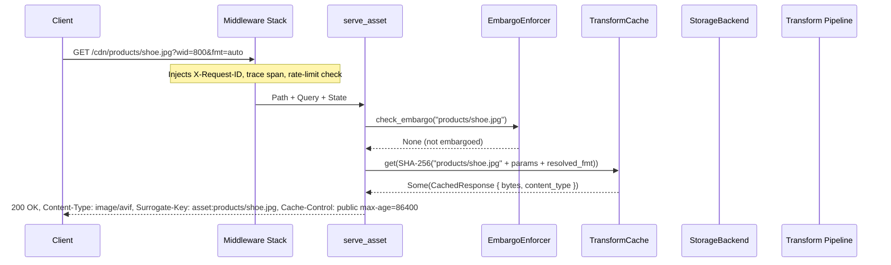

---

## Request Lifecycle — Cache Miss with fmt=auto

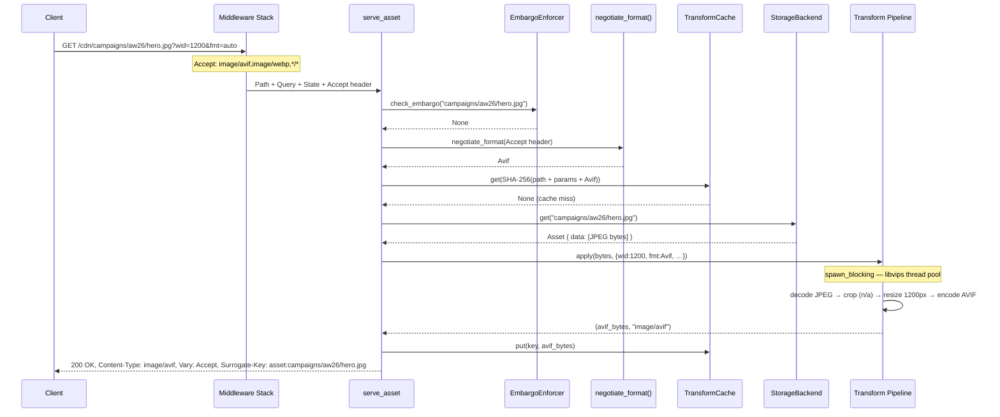

---

## Request Lifecycle — Embargoed Asset

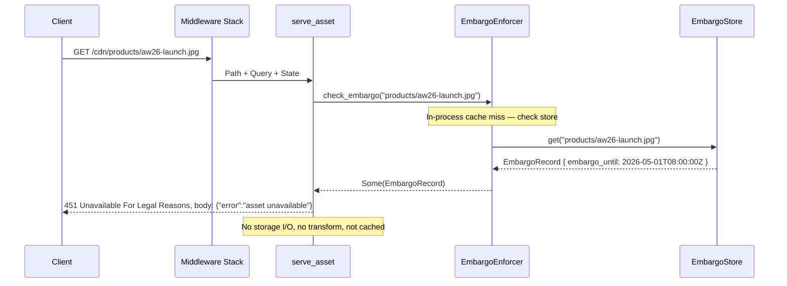

---

## Admin API — Create Embargo (OIDC Auth)

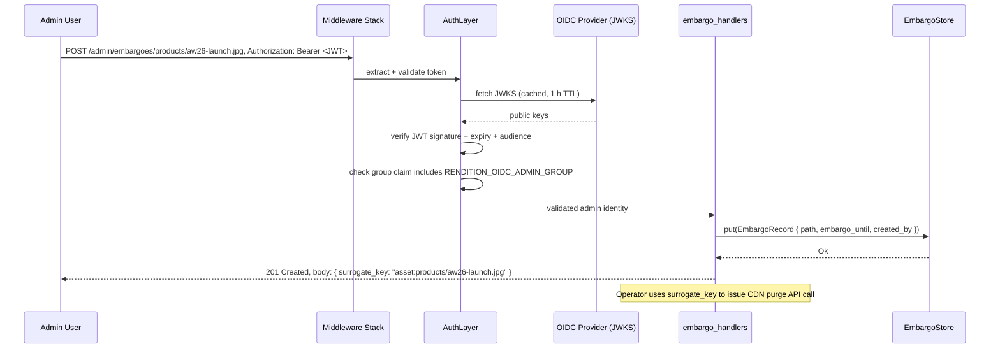

---

## Transform Pipeline — Operation Order

```mermaid
flowchart LR
    A[Raw bytes\nfrom storage] --> B[Decode\nnew_from_buffer]
    B --> FMT{fmt=auto?}
    FMT -- yes --> NEG[negotiate_format\nAccept header → AVIF/WebP/PNG/JPEG]
    FMT -- no --> CROP
    NEG --> CROP
    CROP{crop\nparam set?}
    CROP -- yes --> D[extract_area\nx,y,w,h]
    CROP -- no --> E{wid or hei\nset?}
    D --> E
    E -- yes --> F{fit mode}
    E -- no --> SHARP
    F -- constrain\ndefault --> F1[ops::resize\nscale = min ratio]
    F -- crop --> F2[ops::resize max ratio\n+ extract_area center]
    F -- stretch\nfill --> F3[ops::resize\nindependent hscale/vscale]
    F1 --> SHARP
    F2 --> SHARP
    F3 --> SHARP
    SHARP{sharpening\nparam set?}
    SHARP -- yes --> SH[ops::sharpen\nsigma]
    SHARP -- no --> WM
    SH --> WM
    WM{watermark\nparam set?}
    WM -- yes --> WMO[composite overlay\nwatermark + opacity]
    WM -- no --> G
    WMO --> G
    G{rotate\nparam set?}
    G -- 90/180/270 --> H[ops::rot]
    G -- none --> I{flip\nparam set?}
    H --> I
    I -- h/v/hv --> J[ops::flip]
    I -- none --> K{resolved\nformat}
    J --> K
    K -- AVIF --> M[heifsave_buffer\nAV1 + quality]
    K -- WebP --> L[webpsave_buffer\nwith quality]
    K -- PNG --> N[pngsave_buffer\nlossless]
    K -- JPEG\ndefault --> O[jpegsave_buffer\nwith quality]
    L --> P[Return bytes\n+ MIME type]
    M --> P
    N --> P
    O --> P
```

---

## Middleware Stack — Tower Layer Order

Layers are applied outermost-first (each wraps all inner layers):

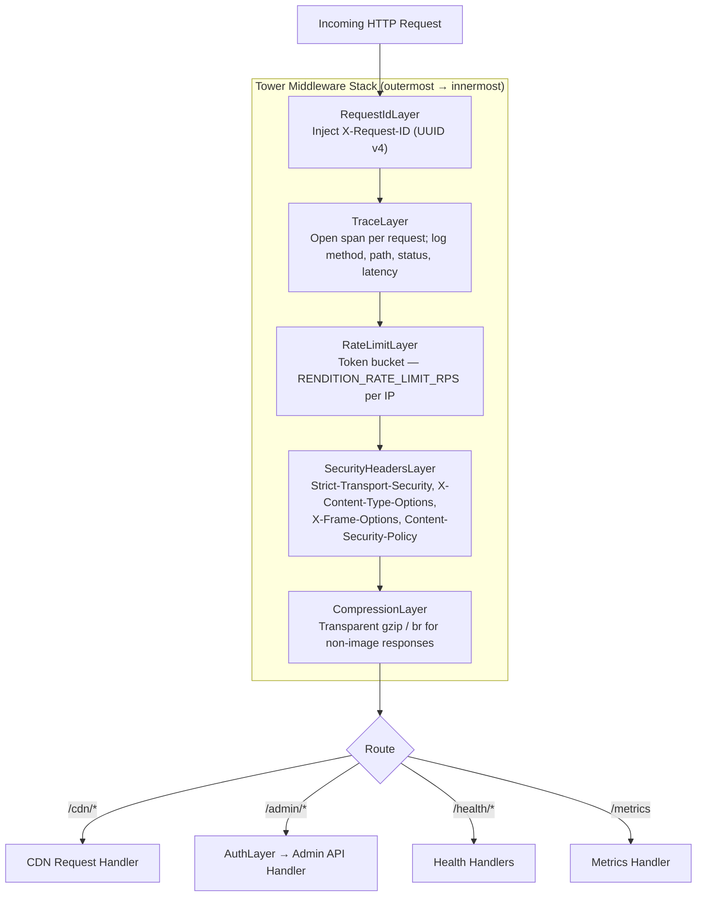

---

## Storage Backend — Class Diagram

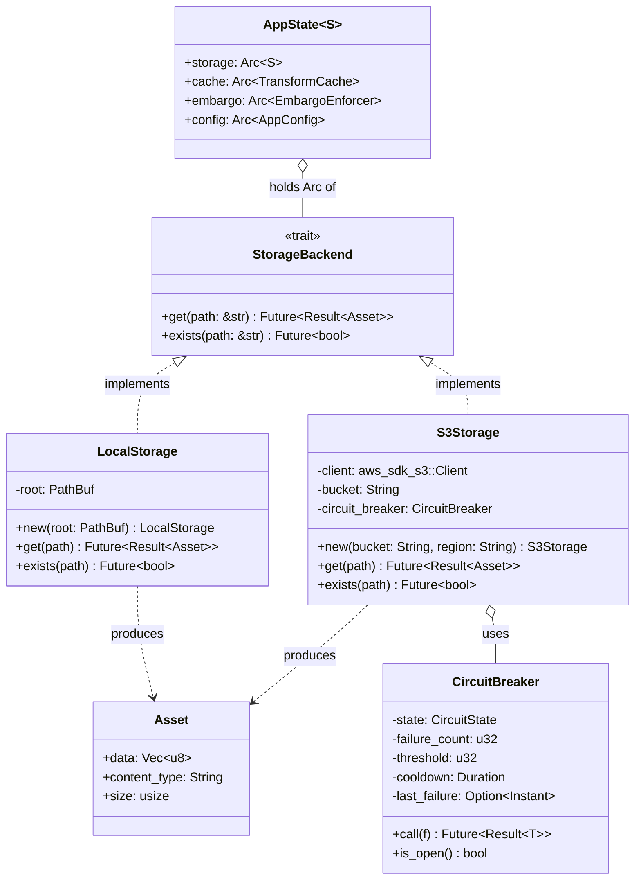

---

## Deployment Topology — Kubernetes

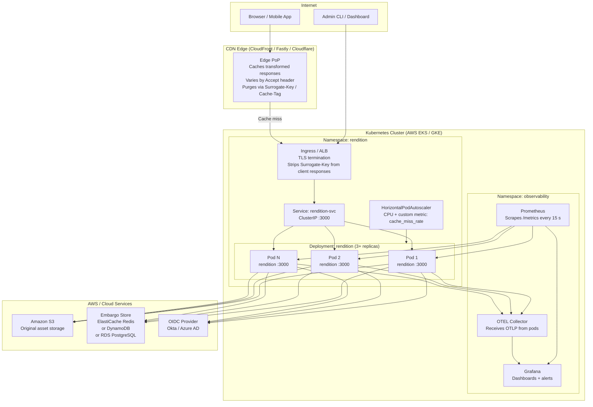

**Scaling notes:**

| Concern | Approach |
|---|---|
| Horizontal scale | Each pod has its own LRU cache; CDN edge acts as the shared caching layer |
| CPU spikes | `spawn_blocking` isolates libvips from the async executor; HPA scales on CPU |
| S3 fault isolation | Circuit breaker opens on consecutive errors; `/health/ready` reports state; K8s stops routing to unready pods |
| Embargo consistency | Embargo store (Redis/DynamoDB/PostgreSQL) is the authoritative source; in-process cache TTL is 10 s |
| Zero-downtime deploy | Rolling update strategy; readiness probe on `/health/ready`; liveness probe on `/health/live` |
