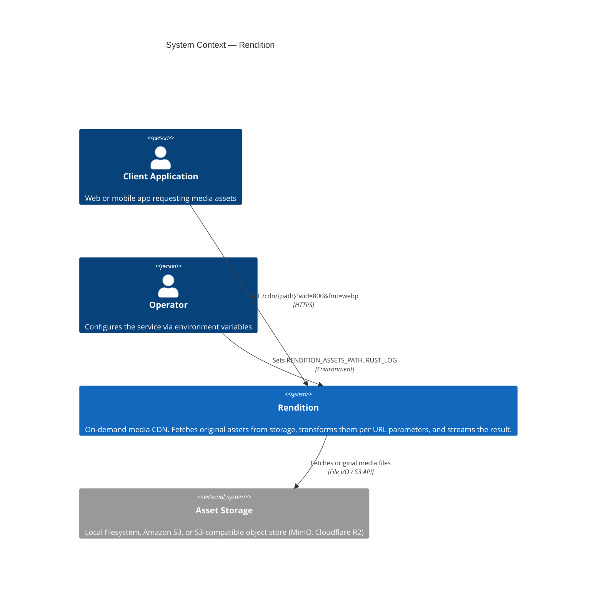
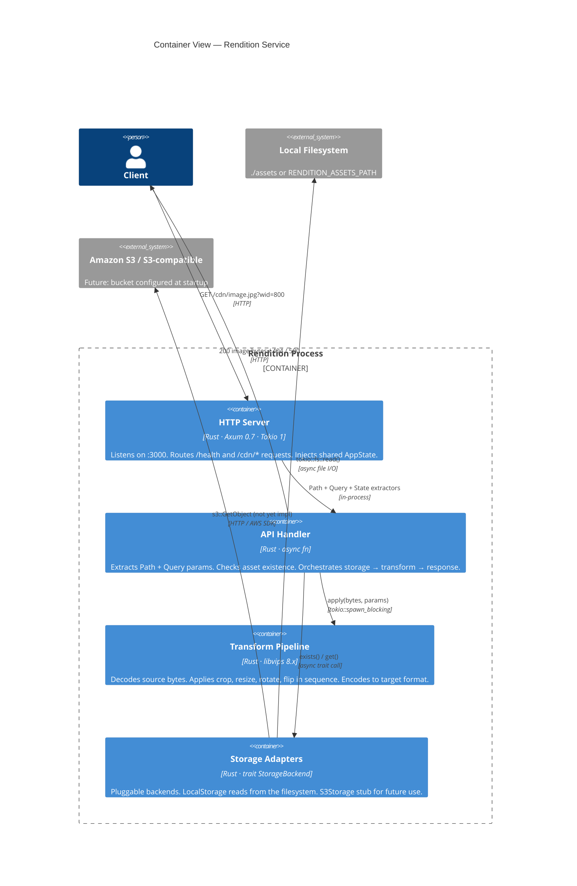
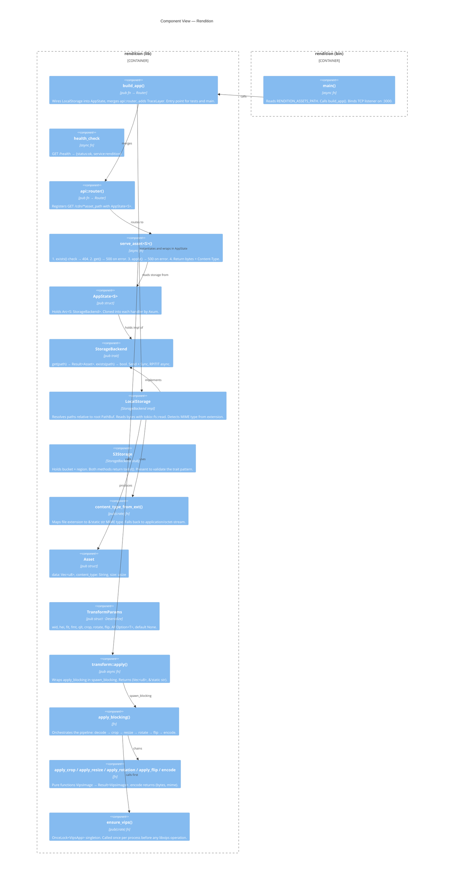
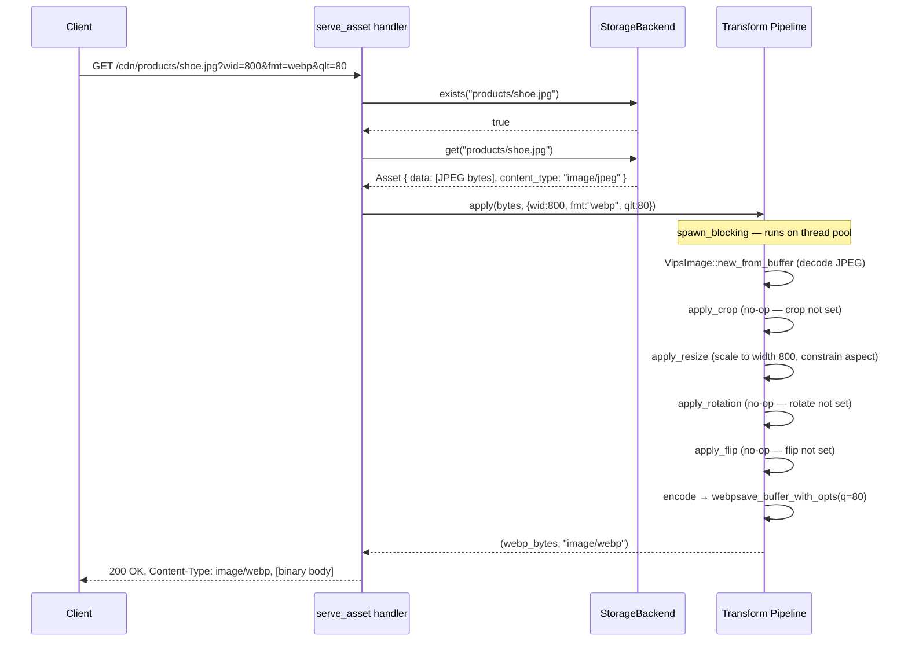
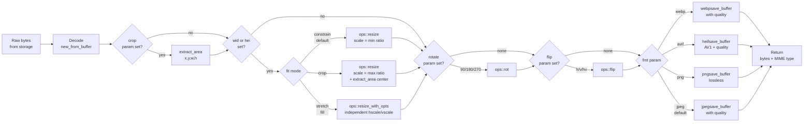
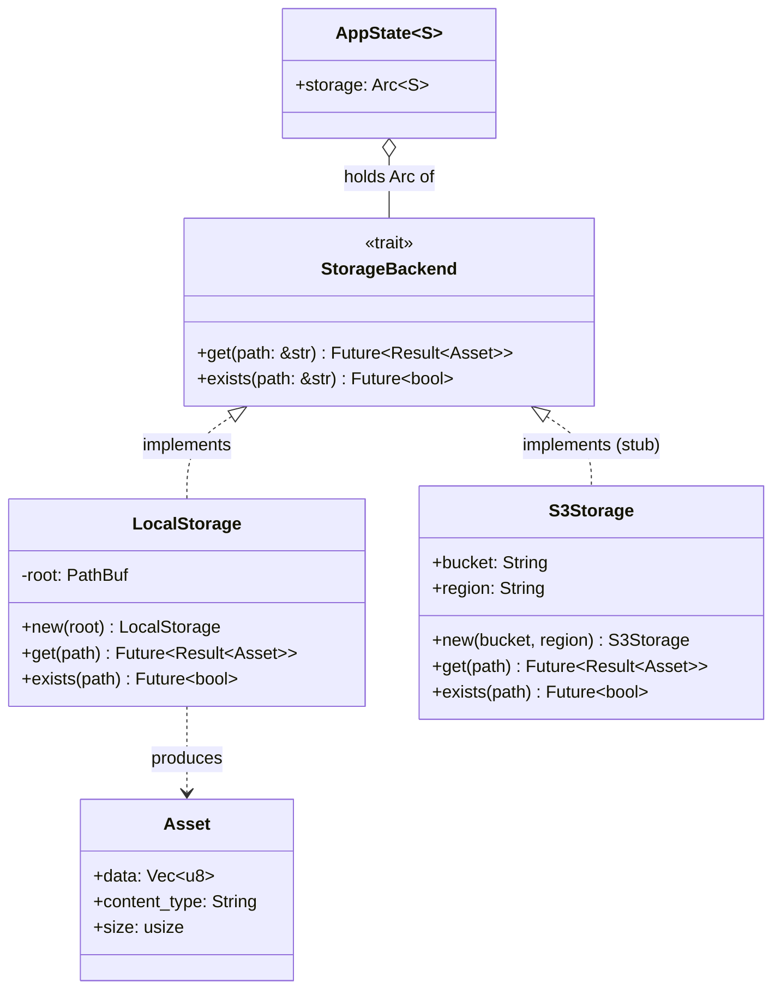

# Rendition — Architecture

Rendition is an open-source, enterprise-ready media CDN written in Rust.
It delivers on-demand image transformations via URL parameters, serving as a
modern alternative to Adobe Scene7.

---

## Level 1 — System Context

**Primary responsibilities:**

- Accept HTTP requests with URL-encoded transform parameters (Scene7-compatible)
- Retrieve original assets from a pluggable storage backend
- Apply a sequential image transform pipeline (crop → resize → rotate → flip → encode)
- Stream the result with the correct `Content-Type` header

---

## Level 2 — Container View

**Key runtime characteristics:**

| Concern | Approach |
|---|---|
| Concurrency | Tokio multi-threaded async executor |
| CPU-bound work | `tokio::task::spawn_blocking` for libvips calls |
| Shared state | `Arc<S>` where `S: StorageBackend` |
| Observability | `tower_http::TraceLayer` + `tracing` structured logs |
| Configuration | Environment variables (`RENDITION_ASSETS_PATH`, `RUST_LOG`) |

---

## Level 3 — Component View

---

## Request Lifecycle — Sequence Diagram

---

## Transform Pipeline — Operation Order

---

## Storage Backend — Class Diagram

